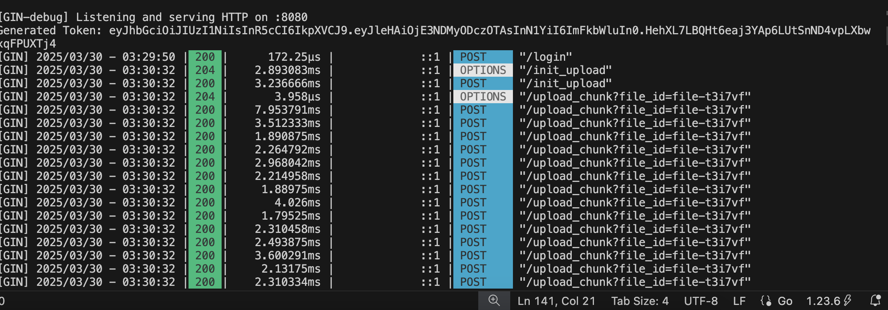
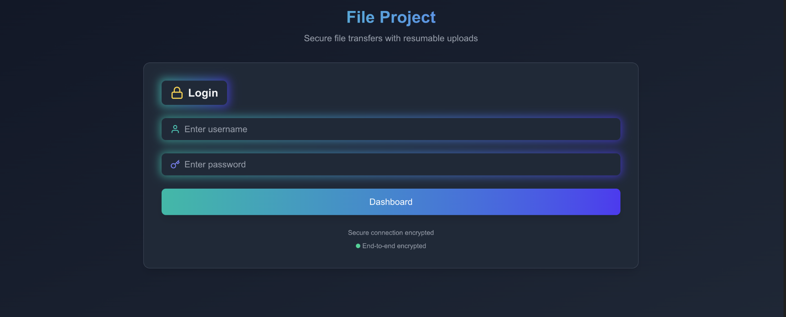

# File Transfer Application
A secure, resumable file transfer web application with authentication and real-time progress tracking.
## Screenshots
  
  


## Features

- **Secure Authentication**: User login with JWT token-based authentication
- **Resumable Uploads**: Continue interrupted uploads from where they left off
- **Chunked Transfers**: Files are transferred in 1MB chunks for reliability
- **Progress Tracking**: Real-time upload progress with speed and time estimates
- **Pause/Resume**: Control over active uploads
- **Automatic Retries**: Failed chunks are automatically retried (up to 3 times)
- **File Status**: Detailed metadata about each transfer
- **Responsive UI**: Works on desktop and mobile devices
- **Error Handling**: Clear error messages and recovery options

## Technologies Used

- **Frontend** Frontend in frontend branch:
  - React with TypeScript
  - Tailwind CSS for styling
  - Framer Motion for animations
  - React Icons (Feather icons)
  - Axios for HTTP requests

- **Backend** main branch:
  - Expected to support resumable uploads via chunked transfer encoding
  - JWT authentication
  - File status tracking

## Installation

1. Clone the repository:
   ```bash
  
   git clone https://github.com/stvishw/file-transfer.git
   cd file-transfer

## How to Start
For Backend
 - cd file-transfer
 - run command: go mod tidy
 - run command: go run cmd/main.go


For Frontend
 - cd file-frontend
 - npm run dev
 - Hit url on browser: localhost:3000

**Credentials**:  username: admin password: admin

## API Endpoints
API Endpoints


Authentication
 - POST /login → User login, returns JWT token.
 - Request: { "username": "user", "password": "pass" }
 - Response: { "token": "jwt_token" }
 - Use token in: Authorization: Bearer <jwt_token>

File Upload (Protected)
 - POST /init_upload → Start file upload, get upload_id.
 - POST /upload_chunk → Upload a chunk of a file.

 File Download
 - GET /download/:file_id → Download a file by ID.

 File Status
  - GET /status/:file_id → Check file upload status.


Method	Endpoint	Description	Request	Response
POST	/login	Authenticate user	{ username: string, password: string }	{ access_token: string }
File Operations (Require Authentication)
Method	Endpoint	Description	Headers	Parameters	Request Body
POST	/init_upload	Initialize file upload	Authorization: Bearer <token>	file_id, total_size query params	None
POST	/upload_chunk	Upload file chunk	Authorization: Bearer <token>, Content-Range: bytes <start>-<end>/<total>	None	File chunk binary data


## Public Endpoints
Method	Endpoint	Description	Headers	Parameters
GET	/status/:file_id	Check file upload status	None	file_id in URL path
GET	/download/:file_id	Download complete file	None	file_id in URL path


## CORS Configuration
The API is configured with the following CORS policies:
Allowed Origin: http://localhost:3000
Allowed Methods: GET, POST, PUT, DELETE, OPTIONS
Allowed Headers: Content-Type, Authorization, Content-Range
Credentials: true


## HTTP status codes:

401 Unauthorized - Invalid or missing authentication token
404 Not Found - Requested resource not found
400 Bad Request - Invalid request parameters
500 Internal Server Error - Server-side error
